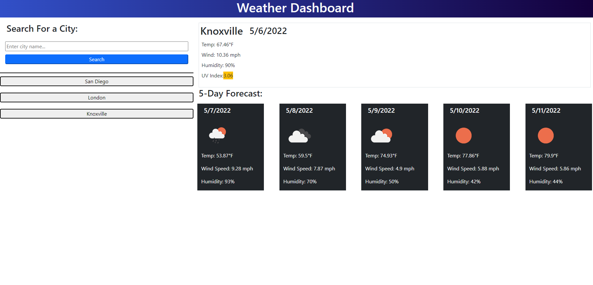

# ucb-challenge6

## Description
A weather site which takes in a city name and outputs:  
1. The current weather conditions, including temperature, wind speed, humidity, and UV Index,
2. The 5-day forecast for the above conditions.  
Previously searched cities are saved to local storage and show on the page as clickable buttons.  

Link: https://ah-fang.github.io/ucb-challenge6/

## Screenshot
